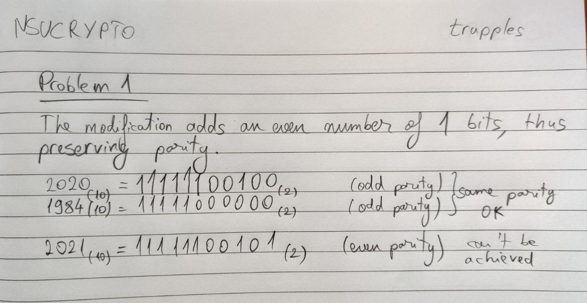
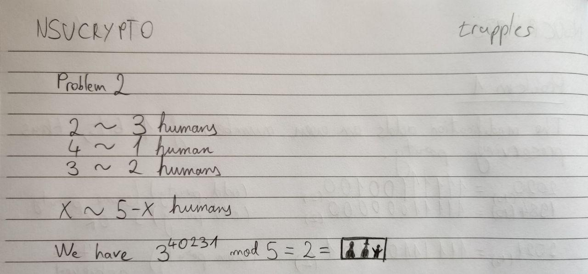

# NSUCRYPTO 2020 Solutions

## Round 1

| Problem   | №1 | №2 | №3 | №4 | №5 | №6 | №7 | Sum |
|:---------:|:--:|:--:|:--:|:--:|:--:|:--:|:--:|:---:|
| Max score | 4  | 4  | *  | 4  | 4  | 6  | 4  |     |
| My score  | 4  | 4  | -  | 4  | 4  | 6  | 2  | 24  |

### Problem 1. 2020
[Problem statement](https://nsucrypto.nsu.ru/archive/2020/round/1/section/2/task/1/#data)




### Problem 2. A secret house
[Problem statement](https://nsucrypto.nsu.ru/archive/2020/round/1/section/2/task/2/#data)




### Problem 3. Miller-Rabin revisited
[Problem statement](https://nsucrypto.nsu.ru/archive/2020/round/1/section/2/task/3/#data)

No solution.


### Problem 4. RGB
[Problem statement](https://nsucrypto.nsu.ru/archive/2020/round/1/section/2/task/4/#data)

I initially tried solving it algebraically by considering each query as a
matrix multiplication mod 324:

```
R = ( 1   18 )
    ( 18  -1 )

G = ( 17  6  )
    ( -6  17 )

B = ( -10 -15 )
    ( 15  -10 )
```

With the goal of getting from (20,20) to (0,0) mod 324.

A very nice property was that B\*G = G\*B, so they commute, so you can rearrange
any sequence of consecutive B and G queries to something like B^b * G^g, b,g
natural numbers.

Unfortunately, R does not have this property. If it had had it, it would have
been possible to rearrange the entire sequence of moves to this form:

R^r * G^g * B^b * (20,20)  , with r,g,b natural numbers

Oh well, i was probably on the right track, but I figured I could just make a
directed graph which describes how each element in Z_324^2 can be transformed
by the 3 matrices, and then show there is no path from (20,20) to (0,0).

I am not storing the graph structure, as from each (a,b) node we can easily
compute its 3 direct successors. I am using a basic BFS to get a set of all
possible (a,b) values.

Solution script: [./round1/nsu-p4.py](./round1/nsu-p4.py)


### Problem 5: Mysterious event
[Problem statement](https://nsucrypto.nsu.ru/archive/2020/round/1/section/2/task/5/#data)

Solution PDF: [./round1/nsu-p5.pdf](./round1/nsu-p5.pdf)

This is a classic LSB steganography problem. PNG's lossless compression allows us to encode information by subtly changing the image colors (in this case, using the least significant bit to bear our data), and we know that change will persist, unlike in a lossy compression format like JPEG.

The first tool I try on lossless stegano problems is the infamous stegsolve.jar.

IMAGE MISSING, SEE PDF

I immediately go to bit plane 0 of each color channel and noticethe telltale signs of LSB stegano: it is almost full with zeros (whereas an actual image would have a random distribution of 0 and 1), except for the very beginning, the first row:

IMAGE MISSING, SEE PDF

Stegsolve has an integrated tool for LSB extraction in Analyse>Data extract, which helps us successfully extract the message:

IMAGE MISSING, SEE PDF

`They know that you are a spy! Get back to the center right now.`

We now know that Mr. Bob "disappeared" by going to the spy center, whatever that is.


### Problem 6: CPA Game
[Problem statement](https://nsucrypto.nsu.ru/archive/2020/round/1/section/2/task/6/#data)

Graders' comment: the number of queries can be reduced

We can solve this with a 100% success rate in 3 queries:

query 1:
 - victor sends (z1, z2) (implementation: I send the same valid plaintext twice, z1=z2)
 - victor receives next_iv = enc(z1^iv) or enc(z2^iv)

query 2:
 - victor sends (next_iv, next_iv)
 - victor receives enc(0)

query 3:
 - victor sends (enc(0), z3), z3 != enc(0). (implementation: I generate a valid plaintext different to z3)
 - victor either receives enc(0) again, case in which b=0, or not, case in which b=1

Solution script: [./round1/nsu-p6.py](./round1/nsu-p6.py)


### Problem 7: Collisions
[Problem statement](https://nsucrypto.nsu.ru/archive/2020/round/1/section/2/task/7/#data)

Graders's comment: Good effort, but no proof of the correctness of the algorithm.

My [round 1 solution script](./round1/nsu-p7.py) describes an O(N^2) algorithm
and further optimises it to O(NlogN). Check out our round 2 solution below for
an O(N) algorithm created by @GabiTulba.


## Round 2

TODO

| Problem   | №1 | №2 | №3 | №4 | №5 | №6 | №7 | №8 | №9 | №10 | Sum |
|:---------:|:--:|:--:|:--:|:--:|:--:|:--:|:--:|:--:|:--:|:---:|:---:|
| Max score | 4  | 7  | 6  | 12 | *  | *  | 6  | 8  | *  | *   |     |
| Our score | 4  | -  | 6  | 4  | 3  | 6 X| 6  | 8 Y| 3  | 11  | 51  |

X: Open problem - The problem is SOLVED.
Y: BEST SOLUTION!

### Problem 1. POLY
[Problem statement](https://nsucrypto.nsu.ru/archive/2020/round/2/task/1/#data)

[./round2/writeup-1.pdf](./round2/writeup-1.pdf)


### Problem 2. Stairs-Box
[Problem statement](https://nsucrypto.nsu.ru/archive/2020/round/2/task/2/#data)

No solution.

> trupples: While we (but mostly Gabies) explored the subject, we could not find
> any significant breakthrough.


### Problem 3. Hidden RSA
[Problem statement](https://nsucrypto.nsu.ru/archive/2020/round/2/task/3/#data)

[./round2/writeup-3.pdf](./round2/writeup-3.pdf)
[./round2/rsa.py](./round2/rsa.py) - Requires yafu
[./round2/rsa-hardcoded-pq.py](./round2/rsa-hardcoded-pq.py) - Does not require yafu

### Problem 4. Orthomorphisms
[Problem statement](https://nsucrypto.nsu.ru/archive/2020/round/2/task/4/#data)

> trupples: We were mega hyped to see how this did and thought we had an
> excellent solution, but apparently we pretty much flunked it from the start.
> Still, it was a very nice exercise in technical writing which we were, at
> least initially, very very very proud of!

Graders' comment: Q1. Wrong answer. Q2. A partial solution. Note that \theta and \pi are permutations. You get relations such that \pi is a permutation but forget about conditions on \theta. So, you only get a partial solution. Therefore, your total number of solutions (including 36864 ) are wrong because you consider r1,r2,c1,c2,q1,q2,b1,b2 such that \theta is not a permutation.

[./round2/writeup-4.pdf](./round2/writeup-4.pdf)

[./round2/dihedral.py] - The beautiful yet wrong script that led us to wrong suppositions about the structure of orthomorphisms AAAAA

### Problem 5. JPEG Encoding
[Problem statement](https://nsucrypto.nsu.ru/archive/2020/round/2/task/5/#data)

> trupples: I loved the idea for this task, and thought I'd do well, so I left
> it to the last 2 days. Turns out my compression ideas were absolute trash and
> barely managed to improve the initial compression ratio by a couple percent.

Graders' comment: The authors provide discussion how they improve the compression but they do not provide any code confirming their proposed algorithm at all. Some of their ideas look correct but we can not confirm their numbers because the code is absent.

> trupples: oops

[./round2/writeup-5.pdf](./round2/writeup-5.pdf)

[./round2/nsu-p5.py](./round2/nsu-p5.py) - Horribly messy script that benchmarks a handful of compression schemes


### Problem 6. Miller-Rabin Revisited
[Problem statement](https://nsucrypto.nsu.ru/archive/2020/round/2/task/6/#data)

Graders' comment: Q1 OK! Q2 Solved. Although not entirely accurate reasoning. But one can catch the right answer. Interesting handling of Carmichael numbers.

[./round2/writeup-6.pdf](./round2/writeup-6.pdf)

TODO @GabiTulba


### Problem 7. CPA Game
[Problem statement](https://nsucrypto.nsu.ru/archive/2020/round/2/task/7/#data)

Graders' comment: OK! (Note: the number of queries can be reduced).

[./round2/writeup-7.pdf](./round2/writeup-7.pdf)

[./round2/nsu-p7.py](./round2/nsu-p7.py) - Basically the same script as round 1. Turns out you can do it in less queries!


### Problem 8. Collisions
[Problem statement](https://nsucrypto.nsu.ru/archive/2020/round/2/task/8/#data)

Graders' comment: Correct solution for all 3 subproblems. Great presentation!

[./round2/writeup-8.pdf](./round2/writeup-8.pdf)


### Problem 9. Bases
[Problem statement](https://nsucrypto.nsu.ru/archive/2020/round/2/task/9/#data)

> trupples: I mega half assed this, and didn't even correctly interpret the task
> at hand 🤦 Better luck next time.

Graders' comment: No mathematical solution proposed by these authors, only a program that looks correct but is very basic. No result of the program is given. Note. The rating scale has been slightly revised.

[./round2/writeup-9.pdf](./round2/writeup-9.pdf)

[./round2/bases.py](./round2/bases.py) - Exploration attempts..


### Problem 10. AES-GCM
[Problem statement](https://nsucrypto.nsu.ru/archive/2020/round/2/task/10/#data)

[./round2/writeup-10.pdf](./round2/writeup-10.pdf)

TODO @GabiTulba

